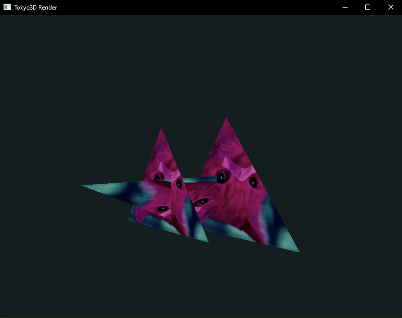

# Tokyo3D
by 0xBB403

A small 3D software renderer written in C. Hobby project demonstrating a software pipeline for transforming, clipping, projecting, and rasterizing 3D geometry. Outputs a framebuffer that can be displayed using SDL3 or other libraries.

## Features

- Data-oriented, Vertex-centered (SoA) design
- Pipeline: transform → clipping (Z → projection → screen) → interpolation
- Right-handed coordinate system, using Euler angles
- `STRUCT_NAME_function(...)` conventions indicate modifications of the struct
- Z-clipping works on (-1, 1, z) → (1, -1, -z) vertex data (like OpenGL)
- Texture support

## Screenshot



## Compilation

```bash
gcc main.c src/*.c -Ilib -Isdl/include -Lsdl/lib -lSDL3 -lm -o app

